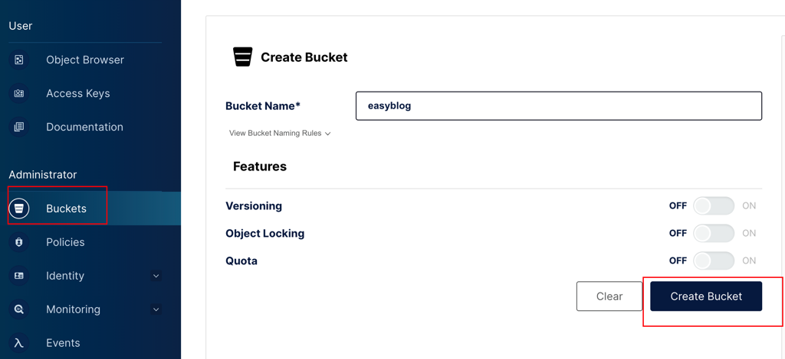
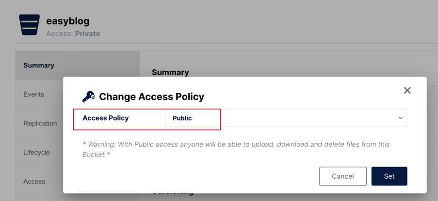
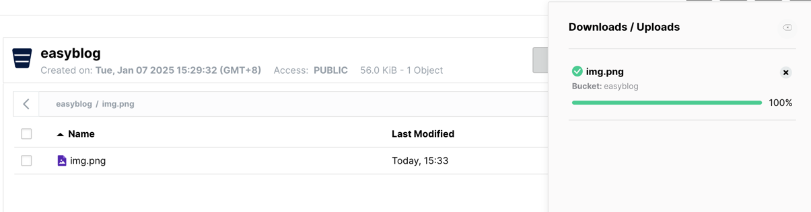

# Project Name
**EasyBlog - A DDD-Based Frontend-Backend Separated Blog Project**

## Table of Contents
1. [Project Overview](#project-overview)
2. [Features](#features)
3. [Technology Stack](#technology-stack)
4. [Getting Started](#getting-started)
   - [System Requirements](#system-requirements)
   - [Installation Steps](#installation-steps)
   - [Run the Project](#run-the-project)
5. [API Documentation](#api-documentation)
6. [Project Structure](#project-structure)
7. [Contribution Guide](#contribution-guide)
8. [License](#license)

---

## Project Overview
EasyBlog is a blog system based on SpringBoot and MyBatis, designed to provide an efficient platform for personal content management and presentation. The system is divided into two main modules: **Admin Management Backend** and **Frontend Display**, covering the entire process from content creation and category management to user interaction.

### Admin Management Backend
The Admin module allows administrators to efficiently manage site content and functionality, including:
- **User Login**: Secure user authentication.
- **Dashboard**: Overview of key metrics and statistics of the blog system.
- **Article Management**: Supports article creation, editing, and deletion.
- **Image Library Management**: Manage image resources on the site.
- **Comment Management**: Review and manage user comments.
- **Category Management**: Flexible definition of article categories.
- **Tag Management**: Manage tags for articles to facilitate content search.
- **Knowledge Base Management**: Organize and present systematic knowledge content.
- **Blog Settings**: Configure basic site information and features.

### Frontend Display
The frontend module provides a user-friendly interface for browsing and interacting with content, including:
- **Homepage**: Display the latest or recommended articles.
- **Article Details Page**: Display detailed article content and related comments.
- **Category List Page**: View articles by category.
- **Tag List Page**: Filter content by tags.
- **Article Archive Page**: Archive articles chronologically.
- **Global Search**: Display search results based on keywords.
- **Comment Display**: Users can view and leave comments.
- **Knowledge Base**: Query and browse systematic knowledge content.

---

## Features
- User registration and login
- JWT-based authentication
- Lucene-powered global search
- RESTful API design
- Multi-environment configuration (development, testing, production)
- Support for unit and integration testing

---

## Technology Stack
- **Backend Framework**: Spring Boot 2.7.12
- **Security**: Spring Security, JWT
- **Database**: MySQL 8
- **ORM**: MyBatis
- **Build Tool**: Maven 3.5
- **Testing Framework**: JUnit 4

---

## Getting Started

### System Requirements
Ensure your development environment meets the following requirements:
- JDK 1.8
- Spring Boot 2.7.12
- Maven 3.8.8
- MySQL 8.0.32
- MinIO 8.5.14

### Installation Steps

1. Clone the project repository:
   ```bash  
   git clone https://github.com/benjieqiang/EasyBlog.git  
   cd easyblog  
   ```

2. Set up the environment by running the Docker Compose file located in `docs/dev-ops/docker-compose-environment.yml` to install MySQL and MinIO.

3. Configure the database:
   - Create a new database named `easyblog` with the **utf8mb4** character set.
   - Import the table structure from `docs/dev-ops/mysql/easyblog.sql`.
   - Update database settings in `src/main/resources/application.yml`.

4. Configure MinIO:
   1. Create a bucket.  
      
   2. Set the bucket permissions to public.  
      
   3. Click `Object Browser -> Upload` to upload images.  
      
   4. Access images via `http(s)://<MINIO_SERVER>/<BUCKET_NAME>/<OBJECT_NAME>`.  
      Example: Open `http://127.0.0.1:9000/easyblog/img.png` in a browser to verify image accessibility.
   5. Click `Access Keys` to create an access key and configure it in the YAML file.  
      

5. change `applicatin-dev.yml`
```yaml
  # 邮箱
  mail:
    host: smtp.qq.com 
    username:  your mail@qq.com 
    password:  password 
    default-encoding: utf-8 
    protocol: smtps 
    port: 465 
  #  step4 accesskey
  minio:
     enable: false # use: true, other: false
     endpoint: http://127.0.0.1:9000 #endpoint
     accessKey: 2SJcF3wKaztAxns4hO3b #accessKey
     secretKey: 6fVtZ0UapO0USfnqgqKo2naQSbfvkFdesnuChKwQ #secretKey
     bucketName: easyblog # bucketName

  jwt: # APITest#test_generateBase64Key
     issuer: ben
     secret: FUymUYPFOHwnXsf1zSNyb3MJExs6Wdj09FYsZkOTNjWtdZYY245ONXBGYWerMUKlJp7zVXpB
     # token expiretime (unit: min)24*60
     tokenExpireTime: 1440
     tokenHeaderKey: Authorization
     tokenPrefix: Bearer

```
6. Install dependencies and build the project:
   ```bash  
   mvn clean install  
   ```  

### Run the Project
1. Navigate to the `easyblog-app` directory and start the project:
   ```bash  
   mvn spring-boot:run  
   ```  

2. Access the API documentation:
   - Local environment: `http://localhost:8091/doc.html`

---

## Project Structure
```plaintext  
├── README.md  
├── data  
├── docs # Deployment, SQL, and other resources  
├── easyblog-app # Application layer  
├── easyblog-domain # Domain layer  
├── easyblog-infrastructure # Infrastructure layer: DAO, Redis, Lucene, Gateway  
├── easyblog-trigger # Trigger layer: HTTP, tasks, MQ  
├── easyblog-types # Common modules  
└── pom.xml  
```  

---

## Contribution Guide
We welcome contributions! Follow these steps to contribute:
1. Fork the repository.
2. Create a new branch: `git checkout -b feature/your-feature-name`.
3. Commit your changes: `git commit -m "Add your feature description"`.
4. Push to the remote branch: `git push origin feature/your-feature-name`.
5. Submit a Pull Request.

---

## License
This project is licensed under the [Apache License](LICENSE). For more details, see the license file.