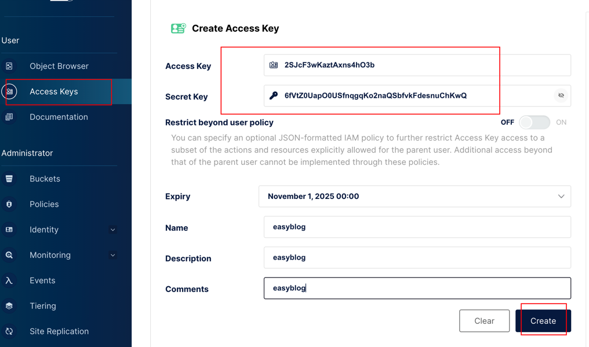

# 项目名称
**EasyBlog-基于DDD开发的前后端分离博客项目**
## 目录
1. [项目简介](#项目简介)
2. [功能特性](#功能特性)
3. [技术栈](#技术栈)
4. [快速开始](#快速开始)
    - [系统要求](#系统要求)
    - [安装步骤](#安装步骤)
    - [运行项目](#运行项目)
5. [API 文档](#api-文档)
6. [项目结构](#项目结构)
7. [贡献指南](#贡献指南)
8. [许可证](#许可证)

---

## 项目简介
本项目是一个基于SpringBoot+MyBatis的博客系统，旨在为个人提供高效的内容管理和展示平台。系统分为 **Admin 管理后台** 和 **前台展示** 两大模块，覆盖了从内容创作、分类管理到用户交互的全流程。


### Admin 管理后台
管理员可以通过管理后台高效地管理站点内容和功能，主要包括以下模块：
- 用户登录：安全的用户身份验证。
- 仪表盘：概览博客系统的关键指标和统计信息。
- 文章管理：支持文章的新增、编辑、删除等操作。
- 图片库管理：管理站点的图片资源。
- 评论管理：对用户评论进行审核和管理。
- 分类管理：灵活定义文章分类。
- 标签管理：管理文章标签，便于内容检索。
- 知识库管理：管理和展示系统化的知识内容。
- 博客设置：配置站点的基本信息和功能。

### 前台展示
前端模块提供友好的用户界面，用于内容浏览和互动，包括以下功能：

- 首页：展示最新或推荐的文章。
- 文章详情页：展示文章的详细内容及相关评论。
- 分类列表页：按分类查看文章。
- 标签列表页：通过标签筛选内容。
- 文章归档页：按时间顺序归档文章。
- 全局搜索：根据关键词展示搜索结果。
- 评论展示：用户可以查看和发表评论。
- 知识库：提供系统化的知识内容查询与浏览。

---


## 功能特性
- 用户注册和登录
- 基于 JWT 的身份验证
- 基于Lucene的全局搜索
- RESTful API 接口设计
- 多环境配置（开发、测试、生产）
- 支持单元测试和集成测试

---

## 技术栈
- **后端框架**：Spring Boot 2.7.12
- **安全**：Spring Security, JWT
- **数据库**：MySQL8
- **ORM**：Mybatis
- **构建工具**：Maven3.5
- **测试框架**：JUnit 4

---

## 快速开始

### 系统要求
确保开发环境满足以下要求：
- JDK 1.8
- SprintBoot 2.7.12
- Maven 3.8.8
- MySQL 8.0.32
- MiniIO 8.5.14

### 安装步骤
1. 克隆项目代码：
   ```bash
   git clone https://github.com/benjieqiang/EasyBlog.git
   cd easyblog
   ```

2. 运行`docs/dev-ops/docker-compose-environment.yml`中的文件，分别安装mysql和miniio docker；
3. 配置数据库：
    - 新建表，easyblog, 选择**utf8mb4**类型，导入`docs/dev-ops/mysql/easyblog.sql`建表语句；
    - 在 `src/main/resources/application.yml` 中修改数据库配置：
      ```yaml
      spring:
        datasource:
          url: jdbc:mysql://localhost:3306/your_database_name
          username: your_username
          password: your_password
      ```
4. 配置miniio
   1. 新建bucket；
   
   2. 设置bucket权限为public；
   
   3. 点击 `Object Browser -> Upload` 上传图片；
   
   4. 访问图片`http(s)://<MINIO_SERVER>/<BUCKET_NAME>/<OBJECT_NAME>`
      浏览器输入 `http://127.0.0.1:9000/easyblog/img.png` 可以正常访问该图片；
   5. 点击`Access Keys` 创建accesskey，配置到yaml中；
   
5. 配置yml
```yaml
  # 邮箱
  mail:
    host: smtp.qq.com # 邮件服务器的地址
    username:  自己的 # 发送邮件的邮箱账号
    password:  自己的 # 授权码，或发送邮件的邮箱账号的密码
    default-encoding: utf-8 # 邮件内容的字符编码
    protocol: smtps # 邮件传输协议：smtps 表示SMTP over SSL，是一种加密的SMTP连接方式，用于确保邮件传输的安全性。
    port: 465 # 邮件服务器的端口号：465 是 SMTPS（SMTP over SSL）的常用端口号，用于加密的邮件传输。
  # 上面网页端配置的accesskey
  minio:
     enable: false # 上线时打开，测试图片上传时打开，其他测试暂时关闭
     endpoint: http://127.0.0.1:9000 #endpoint
     accessKey: 2SJcF3wKaztAxns4hO3b #accessKey
     secretKey: 6fVtZ0UapO0USfnqgqKo2naQSbfvkFdesnuChKwQ #secretKey
     bucketName: easyblog # bucketName

  jwt: # APITest中运行，生成secret, test_generateBase64Key
     # 签发人
     issuer: ben
     # 秘钥
     secret: FUymUYPFOHwnXsf1zSNyb3MJExs6Wdj09FYsZkOTNjWtdZYY245ONXBGYWerMUKlJp7zVXpB
     # token 过期时间（单位：分钟） 24*60
     tokenExpireTime: 1440
     # token 请求头中的 key 值
     tokenHeaderKey: Authorization
     # token 请求头中的 value 值前缀
     tokenPrefix: Bearer

```
6. 安装依赖并构建项目：
   ```bash
   mvn clean install
   ```

### 运行项目
1. 进入`easyblog-app`目录启动项目：
   ```bash
   mvn spring-boot:run
   ```

2. 访问接口文档：
    - 本地环境：`http://localhost:8091/doc.html`
---

## 项目结构
```plaintext
├── README.md
├── data
├── docs # 运维，sql等
├── easyblog-app # application层
├── easyblog-domain # 领域层
├── easyblog-infrastructure # 基础设施层：dao, redis，lucene, gateway 
├── easyblog-trigger # 触发器层：http，task，mq
├── easyblog-types # 公共模块层
└── pom.xml
```

---

## 贡献指南
欢迎贡献！如果您希望参与，请按照以下步骤：
1. Fork 仓库
2. 创建新分支：`git checkout -b feature/your-feature-name`
3. 提交代码：`git commit -m "Add your feature description"`
4. 推送到远程分支：`git push origin feature/your-feature-name`
5. 提交 Pull Request

---

## 许可证
说明项目的版权及使用限制，例如：
> 本项目基于 [Apache License](LICENSE) 开源，详情请参阅许可证文件。